# Anime Studio — Complete Pipeline Integration Map

## Master Data Flow

Three content streams flow through the system: **Text** (story/dialogue), **Image** (character art), and **Video** (animated clips). Each stream has its own generation pipeline, but they converge at the **Shot** level — the atomic unit of production.

```mermaid
graph TB
    subgraph "TEXT STREAM"
        PREMISE[Project Premise<br/>projects.premise] --> STORYLINE[Storyline<br/>storylines table<br/>theme, tone, arcs]
        STORYLINE --> WORLD[World Settings<br/>world_settings table<br/>art_style, location,<br/>color_palette, cinematography]
        STORYLINE --> EP_GEN["Episode Generation<br/>POST /api/episodes<br/>(manual creation)"]
        EP_GEN --> EPISODES[Episodes<br/>episodes table<br/>title, synopsis,<br/>story_arc, tone_profile]
        EPISODES --> SCENE_GEN["Scene Generation<br/>POST /scenes/generate-from-story<br/>story_to_scenes.py<br/>Ollama gemma3:12b"]
        SCENE_GEN --> SCENES[Scenes<br/>scenes table<br/>title, description, location,<br/>time_of_day, mood,<br/>target_duration]
        SCENES --> SHOT_GEN["Shot Generation<br/>POST /scenes/{id}/generate-shots<br/>Ollama gemma3:12b"]
        SHOT_GEN --> SHOTS_TEXT["Shot Metadata<br/>shot_type, camera_angle,<br/>motion_prompt,<br/>characters_present[]"]

        SCENE_GEN --> DIALOGUE_RAW["Dialogue (from AI)<br/>dialogue_character,<br/>dialogue_text<br/>(generated with scenes)"]
        DIALOGUE_RAW --> SHOTS_TEXT

        SHOTS_TEXT --> SCREENPLAY["Screenplay View<br/>ScreenplayView.vue<br/>inline editing, export"]
        SCREENPLAY --> DIALOGUE_EDIT["Manual Dialogue Edit<br/>contenteditable fields"]
        DIALOGUE_EDIT --> SHOTS_TEXT
    end

    subgraph "IMAGE STREAM"
        STYLE[Generation Style<br/>generation_styles table<br/>checkpoint, CFG, steps,<br/>sampler, resolution] --> IMG_GEN
        CHAR[Character<br/>characters table<br/>design_prompt,<br/>appearance_data] --> IMG_GEN
        WORLD --> IMG_GEN

        IMG_GEN["Image Generation<br/>POST /api/visual/generate<br/>comfyui.py → ComfyUI<br/>CheckpointLoader → KSampler"] --> IMG_OUT[Generated Image<br/>generation_history table]
        IMG_OUT --> VISION["Vision Review<br/>POST /api/visual/approval/vision-review<br/>LLaVA scoring:<br/>character_match, clarity,<br/>training_value"]
        VISION -->|"≥0.92"| APPROVED[Approved Images<br/>approvals table<br/>1,289 total]
        VISION -->|"<0.4"| REJECTED[Rejected Images<br/>rejections table<br/>categories → negative prompt]
        VISION -->|"0.4–0.92"| MANUAL[Manual Review<br/>Review tab UI]
        MANUAL --> APPROVED
        MANUAL --> REJECTED
        REJECTED -->|"feedback loop"| IMG_GEN

        APPROVED --> SOURCE_SEL["Source Image Selection<br/>ensure_source_images()<br/>builder.py:542<br/>image_recommender scoring"]
        SOURCE_SEL --> SHOT_IMG["Shot Source Image<br/>shots.source_image_path<br/>shots.source_image_auto_assigned"]
    end

    subgraph "VIDEO STREAM"
        SHOT_IMG --> ENGINE["Engine Selection<br/>engine_selector.py<br/>select_engine()"]
        SHOTS_TEXT --> ENGINE

        ENGINE -->|"solo + source image"| FP_I2V["FramePack I2V<br/>framepack.py<br/>HunyuanVideo DiT<br/>544×704, 30 steps<br/>~10 min"]
        ENGINE -->|"multi-char / no source"| WAN["Wan T2V<br/>wan_video.py<br/>1.3B GGUF<br/>480×720, 49 frames<br/>~4.5 min"]
        ENGINE -->|"has trained LoRA"| LTX["LTX-Video<br/>ltx_video.py<br/>2B DiT + LoRA<br/>native LoRA injection"]

        WAN --> V2V{"V2V Refinement?<br/>framepack_refine.py"}
        V2V -->|"success"| V2V_OUT["Refined Video<br/>544×704, denoise=0.4<br/>preserves 60% Wan layout<br/>~13 min"]
        V2V -->|"fail/OOM"| WAN_RAW["Raw Wan Output<br/>480×720"]

        FP_I2V --> POST["Post-Processing<br/>video_postprocess.py"]
        V2V_OUT --> POST
        WAN_RAW --> POST
        LTX --> POST

        POST --> RIFE["RIFE 4.7<br/>frame interpolation<br/>16→30fps"]
        RIFE --> ESRGAN["RealESRGAN x4 anime<br/>upscale → 2x downscale"]
        ESRGAN --> COLOR["Color Grade<br/>contrast + saturation 1.15"]
        COLOR --> SHOT_VIDEO["Shot Video<br/>shots.output_video_path<br/>960×1440 @ 30fps"]
    end

    subgraph "VOICE STREAM"
        SHOTS_TEXT -->|"dialogue_text"| TTS_ENGINE{"TTS Engine Selection<br/>synthesis.py"}
        CHAR -->|"voice_profile JSONB"| TTS_ENGINE

        TTS_ENGINE -->|"trained model"| RVC["RVC v2<br/>voice conversion<br/>/opt/rvc-v2/"]
        TTS_ENGINE -->|"trained model"| SOVITS["GPT-SoVITS<br/>fast prototyping<br/>/opt/GPT-SoVITS/"]
        TTS_ENGINE -->|"zero-shot clone"| XTTS["XTTS v2<br/>voice cloning<br/>Python 3.11"]
        TTS_ENGINE -->|"fallback"| EDGE["edge-tts<br/>diverse voice pool<br/>always available"]

        RVC & SOVITS & XTTS & EDGE --> VOICE_OUT["Voice Audio<br/>voice_synthesis_jobs table<br/>.wav file"]
    end

    subgraph "AUDIO STREAM"
        SCENES -->|"mood"| MUSIC_GEN{"Music Source"}
        MUSIC_GEN -->|"generate"| ACE["ACE-Step<br/>port 8440<br/>text-to-music<br/>instrumental"]
        MUSIC_GEN -->|"download"| APPLE["Apple Music<br/>30s preview<br/>(auth incomplete)"]
        ACE & APPLE --> MUSIC_FILE["Music Track<br/>scenes.generated_music_path<br/>/output/music_cache/"]
    end

    subgraph "ASSEMBLY PIPELINE"
        SHOT_VIDEO --> AUDIO_MIX["Audio Mixing<br/>scene_audio.py<br/>mix_scene_audio()"]
        VOICE_OUT --> AUDIO_MIX
        MUSIC_FILE --> AUDIO_MIX

        AUDIO_MIX --> DUCK["Audio Ducking<br/>ffmpeg sidechaincompress<br/>threshold=0.02, ratio=6:1<br/>music dips during dialogue"]
        DUCK --> SCENE_VIDEO["Scene Video<br/>scenes.final_video_path<br/>video + dialogue + music"]

        SCENE_VIDEO --> EP_ASM["Episode Assembly<br/>POST /episodes/{id}/assemble<br/>builder.py"]
        EP_ASM --> XFADE["Video Crossfade<br/>ffmpeg xfade filter<br/>dissolve|fade|fadeblack|wipeleft<br/>0.3–0.5s overlap"]
        XFADE --> ACROSSFADE["Audio Crossfade<br/>ffmpeg acrossfade<br/>triangular curve<br/>48kHz stereo normalize"]
        ACROSSFADE --> EP_MUSIC["Episode Music<br/>(if no scene music)<br/>auto-generate from mood"]
        EP_MUSIC --> EPISODE_VIDEO["Episode Video<br/>episodes.final_video_path<br/>+ thumbnail_path"]

        EPISODE_VIDEO --> PUBLISH["Jellyfin Publishing<br/>publish.py<br/>/mnt/1TB-storage/media/anime/<br/>Season NN/ S01E01 - Title.mp4"]
    end

    subgraph "CONTINUITY SYSTEM"
        SHOT_VIDEO -->|"last frame"| CONT_FRAME["Continuity Frame<br/>character_continuity_frames<br/>UPSERT per completion<br/>1 frame per character"]
        CONT_FRAME -->|"next shot reference"| SOURCE_SEL

        SCENES --> SCENE_STATE["Character Scene State<br/>character_scene_state<br/>clothing, injuries,<br/>emotional_state, energy"]
        EPISODES --> TIMELINE["Timeline States<br/>character_timeline_states<br/>personality_shifts,<br/>trauma_events, skills"]
    end

    style SHOTS_TEXT fill:#ff9,stroke:#c90
    style SHOT_IMG fill:#9cf,stroke:#369
    style SHOT_VIDEO fill:#9f9,stroke:#393
    style VOICE_OUT fill:#f9c,stroke:#c36
    style EPISODE_VIDEO fill:#c9f,stroke:#93c
    style APPROVED fill:#6f6,stroke:#393
    style REJECTED fill:#f66,stroke:#c33
```



## Pipeline Stage Detail

### Stage 1: Story → Episodes → Scenes → Shots (TEXT)

| Step | Endpoint | File | Input | Output |
|------|----------|------|-------|--------|
| Create project | `POST /api/story/projects` | story router | name, premise, genre | project record + auto generation_style |
| Define storyline | `PUT /api/story/projects/{id}/storyline` | story router | summary, themes, arcs | storylines record |
| Set world | `PUT /api/story/projects/{id}/world-settings` | story router | art_style, location, palette | world_settings record |
| Create episodes | `POST /api/episodes` | episode router | title, synopsis, story_arc | episodes record (UUID) |
| Generate scenes | `POST /scenes/generate-from-story?project_id=X&episode_id=Y` | story_to_scenes.py | storyline + characters + world | 3–8 scenes with 2–5 shots each |
| Generate shots | `POST /scenes/{id}/generate-shots` | scene_crud.py | scene description + characters | shot records with motion_prompt + dialogue |
| Bulk shots | `POST /scenes/generate-shots-all?project_id=X` | builder.py | all empty scenes | shots for every scene |

**Ollama Prompts:**
- `STORY_TO_SCENES_PROMPT` (story_to_scenes.py:13): Breaks storyline into scenes with suggested_shots including `dialogue_character` + `dialogue_text`
- `EPISODE_TO_SCENES_PROMPT` (story_to_scenes.py:44): Episode-scoped with existing_scenes context for continuity

### Stage 2: Character Images (IMAGE)

| Step | Endpoint | File | Input | Output |
|------|----------|------|-------|--------|
| Generate image | `POST /api/visual/generate/{slug}` | visual_pipeline/comfyui.py | design_prompt + style | PNG in ComfyUI output |
| Vision review | `POST /api/visual/approval/vision-review` | visual_pipeline/vision_review.py | image path | quality_score, match, clarity |
| Batch replenish | `POST /api/system/replenish` | replenishment.py | target count, strategy | images until target met |
| Approve/reject | `POST /api/visual/approve` | visual_review.py | image, decision | approvals/rejections record |

**Key Thresholds:** auto-approve ≥ 0.92, auto-reject ≤ 0.3, manual 0.3–0.92

**Source Image Selection** (`ensure_source_images()` in builder.py:542):
1. Check `approval_status.json` per character dataset
2. Score by: brightness, completeness (full body +0.15, face-only -0.1), no gen_ prefix
3. Assign best image to each shot's `source_image_path`
4. FramePack gets source image; Wan doesn't need one

### Stage 3: Video Generation (VIDEO)

| Engine | When Used | Input | Output | Time |
|--------|-----------|-------|--------|------|
| FramePack I2V | Solo shot + source image | source image + motion prompt | 544×704 @ 30fps | ~10 min |
| Wan T2V | Multi-char OR no source | text prompt only | 480×720 @ 16fps | ~4.5 min |
| FramePack V2V | After Wan (refinement) | Wan video + optional LoRA | 544×704 @ 30fps | ~13 min |
| LTX-Video | Character has trained LoRA | text + LoRA | variable | ~5 min |

**Post-processing chain:** RIFE interpolation → ESRGAN 4x → 2x downscale → color grade
**Final output:** 960×1440 @ 30fps MP4

### Stage 4: Voice Synthesis (VOICE)

| Engine | Priority | Quality | Requirement |
|--------|----------|---------|-------------|
| RVC v2 | 1 (highest) | Best | Trained model at /opt/rvc-v2/ |
| GPT-SoVITS | 2 | High | Reference audio + trained model |
| XTTS v2 | 3 | Good | 1+ WAV samples, Python 3.11 |
| edge-tts | 4 (fallback) | Acceptable | Always available, diverse voices |

**Data path:** `shots.dialogue_text` → TTS engine → `.wav` → `voice_synthesis_jobs.output_path`

### Stage 5: Audio Composition (AUDIO)

| Source | Priority | Generator | Storage |
|--------|----------|-----------|---------|
| ACE-Step | 1 (preferred) | Port 8440, instrumental | scenes.generated_music_path |
| Apple Music | 2 (limited) | 30s preview download | scenes.audio_preview_path |
| Auto-generate | 3 | ACE-Step from mood | output/music_cache/ |

**Mixing:** ffmpeg sidechaincompress — music volume auto-dips during dialogue
**Parameters:** threshold=0.02, ratio=6:1, attack=200ms, release=1000ms

### Stage 6: Episode Assembly (ASSEMBLY)

| Step | Function | Tool | Output |
|------|----------|------|--------|
| Order scenes | episode_scenes junction table | position column | ordered scene list |
| Video crossfade | assemble_episode() | ffmpeg xfade filter | joined video |
| Audio crossfade | acrossfade filter | triangular curve, 48kHz | smooth audio transitions |
| Episode music | _apply_episode_music() | ACE-Step from mood | background track |
| Thumbnail | extract_thumbnail() | first frame as JPG | episodes.thumbnail_path |
| Publish | publish.py | Jellyfin API + symlinks | /mnt/1TB-storage/media/anime/ |

---

## Current State (2026-02-28)

### What's Connected and Working


### What's Built But Disconnected


### What's Missing


---

## Integration Opportunities

### 1. Auto-Voice Pipeline (HIGH IMPACT)

Currently: Dialogue exists in shots but voice synthesis is manual.
**Connect:** After video generation completes for a scene, auto-synthesize all dialogue → mix with video → store as scene audio.

```
Shot completed → check dialogue_text → synthesize via TTS → mix_scene_audio() → update scene video
```

**Files to modify:** `builder.py` (after post-processing, before marking complete)

### 2. Continuity Frame → Source Image (HIGH IMPACT)

Currently: `character_continuity_frames` stored but never queried during source image selection.
**Connect:** In `ensure_source_images()`, check continuity frames FIRST (intra-scene > cross-scene > approved pool).

```
ensure_source_images() → query character_continuity_frames → use if fresher than approved pool
```

**File:** `builder.py:542` (ensure_source_images function)

### 3. Character State → Prompt Injection (MEDIUM IMPACT)

Currently: `character_scene_state` tracks clothing/injuries but doesn't affect video prompts.
**Connect:** When building Wan T2V prompt, inject current character state.

```
build_wan_prompt() → query character_scene_state → append "wearing torn jacket, bleeding arm"
```

**File:** `wan_video.py` or `builder.py` prompt construction

### 4. Auto-Music per Scene (MEDIUM IMPACT)

Currently: ACE-Step works but must be manually triggered per scene.
**Connect:** During episode assembly, auto-generate music for scenes without audio.

```
assemble_episode() → for each scene without music → derive mood from scene.mood → ACE-Step generate → mix
```

**File:** `episode_assembly/builder.py`

### 5. End-to-End Auto-Pipeline (HIGHEST IMPACT)

Connect all stages into a single trigger:

```
POST /api/projects/{id}/produce-episode?episode_number=1

1. Verify all scenes have shots (generate if missing)
2. For each shot (ordered by episode → scene → shot):
   a. Assign source image (ensure_source_images)
   b. Select engine (select_engine)
   c. Generate video (Wan/FramePack/LTX)
   d. V2V refine if Wan
   e. Post-process (RIFE + ESRGAN + color)
   f. Synthesize dialogue audio (TTS)
3. For each scene:
   a. Generate music (ACE-Step from mood)
   b. Mix audio (dialogue + music + ducking)
   c. Compose scene video
4. Assemble episode:
   a. Crossfade transitions
   b. Episode-level music (if needed)
   c. Thumbnail extraction
5. Optional: Publish to Jellyfin
```

**New file:** `packages/scene_generation/full_pipeline.py`

---

## Database Statistics (2026-02-28)

| Entity | Count | Notes |
|--------|-------|-------|
| Projects | 5 | TDD, Mario, GS, Echo Chamber, Fury |
| Episodes | 35 | 6 without scenes |
| Scenes | 127 | 24 without shots |
| Shots | 353 | 175 with dialogue (49.6%) |
| Characters | 36 | across all projects |
| Approved Images | 1,289 | auto + manual approval |
| Voice Samples | 77 | all approved |
| Voice Synthesis Jobs | 63 | 55 completed, 8 stale |
| Continuity Frames | 3 | TDD only |
| Generation History | 3,150+ | all image attempts |
| DB Tables | 105 | includes Apache AGE graph |

## File Reference

| Pipeline Stage | Key Files |
|---|---|
| Story/Scene generation | `packages/story/`, `packages/scene_generation/story_to_scenes.py`, `scene_crud.py` |
| Image generation | `packages/visual_pipeline/comfyui.py`, `vision_review.py`, `replenishment.py` |
| Engine selection | `packages/scene_generation/engine_selector.py` |
| FramePack I2V | `packages/scene_generation/framepack.py` |
| FramePack V2V | `packages/scene_generation/framepack_refine.py` |
| Wan T2V | `packages/scene_generation/wan_video.py` |
| LTX-Video | `packages/scene_generation/ltx_video.py` |
| Post-processing | `packages/scene_generation/video_postprocess.py` |
| Voice synthesis | `packages/voice_pipeline/synthesis.py`, `cloning.py` |
| Audio composition | `packages/audio_composition/router.py`, `scene_generation/scene_audio.py` |
| Episode assembly | `packages/episode_assembly/builder.py`, `publish.py` |
| Orchestrator | `packages/core/orchestrator.py`, `orchestrator_router.py` |
| Model profiles | `packages/core/model_profiles.py` |
| Continuity | `builder.py` (character_continuity_frames), narrative_state package |
| Frontend | `frontend/src/components/` — 6 tabs: Story, Cast, Script, Produce, Review, Publish |
